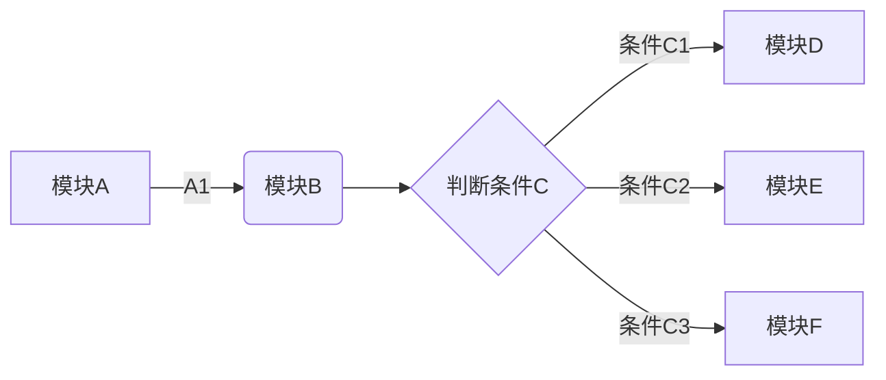
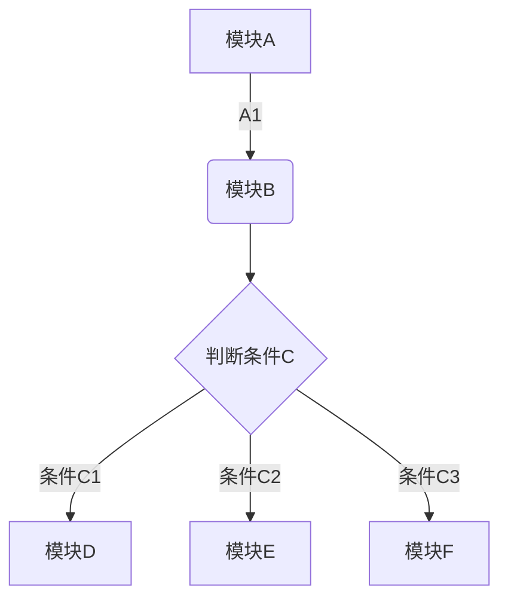
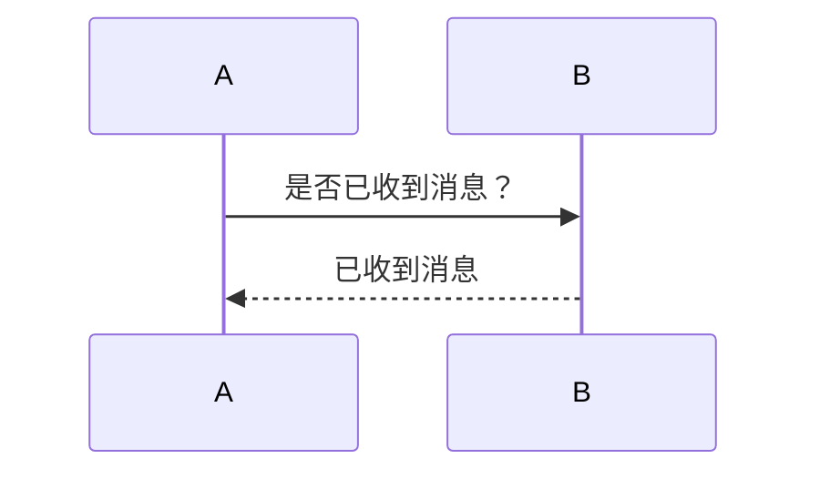
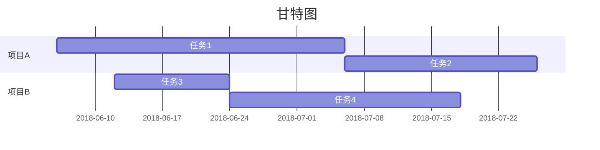

目录
[toc]

标题
# 一级标题
## 二级标题
### 三级标题
#### 四级标题
##### 五级标题
###### 六级标题

文本格式
**加粗文本**
*斜体***
***斜体加粗***
<u>下划线</u>
~~删除线~~

分割线
***

引用
>引用，内容如下：
>天气预报

编号
* 第一
* 第二
* 第三

序号
1. 第一
2. 第二
3. 第三

日程
* [ ] apple
* [ ] banana
* [x] lemon

链接
[链接](http://noahai.cn)


表格
|head1|head2|head3|
|-|-|-|
|r1c1|r1c2|r1c3|
|r2c1|r2c2|r2c3|
|r3c1|r3c2|r3c3|

语言
```java
    for(int i=0;i<19;i++)
    {
        System.out.println("Hello World !");
    }
```

数学公式
```math
    e^{i\pi} + 1 = 0
```

流程图



时序图


甘特图

